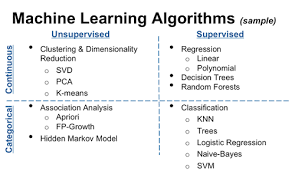

# Basic Notes on Statistical Methods and Models

Note: something like random forest or decision trees can be used for both continuous and categorical problems
  
## Supervised Models
### Decision trees

Decision Tree algorithm belongs to the family of supervised learning algorithms. Unlike other supervised learning algorithms, the decision tree algorithm can be used for solving regression and classification problems too. The goal of using a Decision Tree is to create a training model that can use to predict the class or value of the target variable by learning simple decision rules inferred from prior data(training data).

### Random Forest

The random forest algorithm is an extension of the bagging method as it utilizes both bagging and feature randomness to create an uncorrelated forest of decision trees. Feature randomness, also known as feature bagging or "the random subspace method", generates a random subset of features, which ensures low correlation among decision trees. This is a key difference between decision trees and random forests. While decision trees consider all the possible feature splits, random forests only select a subset of those features. By accounting for all the potential variability in the data, we can reduce the risk of overfitting, bias, and overall variance, resulting in more precise predictions.
 
Note: What is an ensemble method?
Ensemble learning methods are made up of a set of classifiers - e.g. decision trees and their predictions are aggregated to identify the most popular result. The most well-known ensemble methods are bagging, also known as bootstrap aggregation, and boosting. In bagging, a random sample of data in a training set is selected with replacement - meaning that the individual data points can be chosen more than once. After several data samples are generated, these models are then trained independently, and depending on the type of task - i.e. regression or classification - the average or majority of those predictions yield a more accurate estimate. This approach is commonly used to reduce variance within a noisy dataset.

Reference: https://www.ibm.com/cloud/learn/random-forest

### XGBoost - eXtreme Gradient Boosting

Boosting is an ensemble technique where new models are added to correct the errors made by existing models. Models are added sequentially until no further improvements can be made. A popular example is the AdaBoost algorithm that weights data points that are hard to predict. Gradient boosting is an approach where new models are created that predict the residuals or errors of prior models and then added together to make the final prediction. It is called gradient boosting because it uses a gradient descent algorithm to minimize the loss when adding new models.

This approach supports both regression and classification predictive modeling problems.
One of the most important differences between XG Boost and Random forest is that the XGBoost always gives more importance to functional space when reducing the cost of a model while Random Forest tries to give more preferences to hyperparameters to optimize the model.

Reference: https://medium.com/geekculture/xgboost-versus-random-forest-898e42870f30

### LightGBM - Light Gradient Boosting

Light Gradient Boosted Machine, or LightGBM for short, is an open-source library that provides an efficient and effective implementation of the gradient boosting algorithm. LightGBM extends the gradient boosting algorithm by adding a type of automatic feature selection as well as focusing on boosting examples with larger gradients. This can result in a dramatic speedup of training and improved predictive performance.

As such, LightGBM has become a de facto algorithm for machine learning competitions when working with tabular data for regression and classification predictive modeling tasks. As such, it owns a share of the blame for the increased popularity and wider adoption of gradient boosting methods in general, along with Extreme Gradient Boosting (XGBoost).

Reference: 
- https://machinelearningmastery.com/light-gradient-boosted-machine-lightgbm-ensemble/

### Light GBM or XGBoost?

- In XGBoost, trees grow depth-wise while in LightGBM, trees grow leaf-wise which is the fundamental difference between the two frameworks.
- XGBoost is backed by the volume of its users that results in enriched literature in the form of documentation and resolutions to issues. While LightGBM is yet to reach such a level of documentation.
- Both the algorithms perform similarly in terms of model performance but LightGBM training happens within a fraction of the time required by XGBoost.
- Fast training in LightGBM makes it the go-to choice for machine learning experiments.
- XGBoost requires a lot of resources to train on large amounts of data which makes it an accessible option for most enterprises while LightGBM is lightweight and can be used on modest hardware.
- LightGBM provides the option for passing feature names that are to be treated as categories and handles this issue with ease by splitting on equality. 
- H2O’s implementation of XGBoost provides the above feature as well which is not yet provided by XGBoost’s original library.
- Hyperparameter tuning is extremely important in both algorithms.

References:
- https://neptune.ai/blog/xgboost-vs-lightgbm
- https://www.analyticsvidhya.com/blog/2017/06/which-algorithm-takes-the-crown-light-gbm-vs-xgboost/

### Adaboost
AdaBoost is short for Adaptive Boosting. AdaBoost was the first successful boosting algorithm developed for binary classification. Also, it is the best starting point for understanding boosting algorithms. It is adaptive in the sense that subsequent classifiers built are tweaked in favour of those instances misclassified by previous classifiers. It is sensitive to noisy data and outliers. 

AdaBoost uses multiple iterations to generate a single composite strong learner. It creates a strong learner by iteratively adding weak learners. During each phase of training, a new weak learner is added to the ensemble, and a weighting vector is adjusted to focus on examples that were misclassified in previous rounds. The result is a classifier that has higher accuracy than the weak learner classifiers.

Reference: https://www.mygreatlearning.com/blog/xgboost-algorithm/

### Logistic Regression

Logistic regression is a process of modeling the probability of a discrete outcome given an input variable. The most common logistic regression models a binary outcome; something that can take two values such as true/false, yes/no, and so on.

#### Should I use logistic regression or a decision tree?
Decision Trees are non-linear classifiers; they do not require data to be linearly separable. When you are sure that your data set divides into two separable parts, then use a Logistic Regression. If you're not sure, then go with a Decision Tree. A Decision Tree will take care of both.

### Linear Regression

Linear regression attempts to model the relationship between two variables by fitting a linear equation to observed data. One variable is considered to be an explanatory variable, and the other is considered to be a dependent variable. For example, a modeler might want to relate the weights of individuals to their heights using a linear regression model. Before attempting to fit a linear model to observed data, a modeler should first determine whether or not there is a relationship between the variables of interest. This does not necessarily imply that one variable causes the other (for example, higher SAT scores do not cause higher college grades), but that there is some significant association between the two variables. A scatterplot can be a helpful tool in determining the strength of the relationship between two variables. If there appears to be no association between the proposed explanatory and dependent variables (i.e., the scatterplot does not indicate any increasing or decreasing trends), then fitting a linear regression model to the data probably will not provide a useful model. A valuable numerical measure of association between two variables is the correlation coefficient, which is a value between -1 and 1 indicating the strength of the association of the observed data for the two variables.

A linear regression line has an equation of the form Y = a + bX, where X is the explanatory variable and Y is the dependent variable. The slope of the line is b, and a is the intercept (the value of y when x = 0).

Remember to check assumptions of linear regression first:
There are four assumptions associated with a linear regression model.
- Linearity: The relationship between X and the mean of Y is linear.
- Homoscedasticity: The variance of residual is the same for any value of X.
- Independence: Observations are independent of each other.
- Normality: For any fixed value of X, Y is normally distributed.

## Unsupervised Models

### Clustering
There are many different types of clustering algorithms

### K-means clustering algorithm
K-means clustering is the most commonly used clustering algorithm. It's a centroid-based algorithm and the simplest unsupervised learning algorithm. This algorithm tries to minimize the variance of data points within a cluster. It's also how most people are introduced to unsupervised machine learning.

K-means is best used on smaller data sets because it iterates over all of the data points. That means it'll take more time to classify data points if there are a large amount of them in the data set. Since this is how k-means clusters data points, it doesn't scale well.

Reference: https://www.freecodecamp.org/news/8-clustering-algorithms-in-machine-learning-that-all-data-scientists-should-know/

### Dimension Reduction Techniques

### PCA
PCA is defined as an orthogonal linear transformation that transforms the data to a new coordinate system such that the greatest variance by some scalar projection of the data comes to lie on the first coordinate (called the first principal component), the second greatest variance on the second coordinate, and so on.

https://towardsdatascience.com/principal-component-analysis-pca-explained-visually-with-zero-math-1cbf392b9e7d#:~:text=PCA%20is%20defined%20as%20an,second%20coordinate%2C%20and%20so%20on.
## Stochastic models

### Markov Chains

The main goal of the Markov process is to identify the probability of transitioning from one state to another. This is one of the main appeals to Markov, that the future state of a stochastic variable is only dependent on its present state.
Markov Chains are exceptionally useful in order to model a discrete-time, discrete space Stochastic Process of various domains like Finance (stock price movement), NLP Algorithms (Finite State Transducers, Hidden Markov Model for POS Tagging), or even in Engineering Physics (Brownian motion). 

Great video going through the basics:
- https://www.youtube.com/watch?v=i3AkTO9HLXo

And a post with more information:
- https://towardsdatascience.com/introduction-to-markov-chains-50da3645a50d

## Other

### Bayesian Statistics
 The solution is a statistical technique called Bayesian inference. This technique begins with our stating prior beliefs about the system being modelled, allowing us to encode expert opinion and domain-specific knowledge into our system. These beliefs are combined with data to constrain the details of the model. Then, when used to make a prediction, the model doesn’t give one answer, but rather a distribution of likely answers, allowing us to assess risks.
https://towardsdatascience.com/what-is-bayesian-statistics-used-for-37b91c2c257c

## Data comparison

### T-test

The Student's t test is used to compare the means between two groups, whereas ANOVA is used to compare the means among three or more groups.

Note: The One-way ANOVA is extension of independent samples t test (In independent samples t test used to compare the means between two independent groups, whereas in one-way ANOVA, means are compared among three or more independent groups).

### ANOVA 

Analysis of variance (ANOVA) is an analysis tool used in statistics that splits an observed aggregate variability found inside a data set into two parts: systematic factors and random factors. The systematic factors have a statistical influence on the given data set, while the random factors do not. Analysts use the ANOVA test to determine the influence that independent variables have on the dependent variable in a regression study.

There are two main types of ANOVA: one-way (or unidirectional) and two-way. There also variations of ANOVA. For example, MANOVA (multivariate ANOVA) differs from ANOVA as the former tests for multiple dependent variables simultaneously while the latter assesses only one dependent variable at a time. One-way or two-way refers to the number of independent variables in your analysis of variance test.

#### One-way ANOVA (one independent group, one dependent)

A one-way ANOVA evaluates the impact of a sole factor on a sole response variable. It determines whether all the samples are the same. The one-way ANOVA is used to determine whether there are any statistically significant differences between the means of three or more independent (unrelated) groups.

#### Two-way ANOVA (two independent groups, one dependent)

A two-way ANOVA is an extension of the one-way ANOVA. With a one-way, you have one independent variable affecting a dependent variable. With a two-way ANOVA, there are two independents. For example, a two-way ANOVA allows a company to compare worker productivity based on two independent variables, such as salary and skill set. It is utilized to observe the interaction between the two factors and tests the effect of two factors at the same time.

#### Three-way ANOVA (three independent groups, one dependent)

The three-way ANOVA is used by statisticians to determine whether there is a three-way relationship among variables on an outcome. It determines what effect, if any, three factors had on an outcome. Three-way ANOVAs are useful for gaining an understanding of complex interactions where more than one variable may influence the result 

Reference for all 3 images above: https://www.datanovia.com/en/lessons/repeated-measures-anova-in-r/

#### Four-way ANOVA (four independent groups, one dependent)

A four way ANOVA is a factorial ANOVA (unless you are thinking of some other meaning for four-way).
Each factor represents one variable (a set of categories or treatment types or treatment dosages).
Here is an example:
Factor 1: sex (female, male) 2 groups or 2 levels
Factor 2: drug dosage (low, medium, high) 3 groups or 3 levels
Factor 3: age (young, middle aged, old) 3 groups
Factor 4: psychotherapy (yes, no) 2 groups

In a factorial design, you examine average scores on an outcome variable (such as anxiety) for all possible combinations of groups or levels. In this example you would have 2 x 3 x 3 x 2 = 36 different combinations; one combination of conditions would be male, low drug dose, middle aged, no psychotherapy. If you want to have at least 10 people for each combination of conditions,, you would need 2 x 3 x 3 x 2 x 10 = 360 people total.

Usually the main point of a factorial design is to evaluate interactions (for example, does increasing drug dose have a different effect on the outcome for males versus females?). It is very common to have 2 way factorials, and fairly common to have 3 way factorial design. It is rare to have 4 and 5 way factorials - you begin to need a very large number of people to fill up all the groups, and the interactions among multiple variables start to become very complicated.
https://www.quora.com/What-is-a-4-way-ANOVA

Img reference: https://www.researchgate.net/figure/Four-way-ANOVA-analysis-of-differences-in-resistance-to-oxidative-stress-depending-on-sex_fig4_361190166

#### MANOVA (multiple dependent variables, one independent group)

Multivariate ANOVA (MANOVA) extends the capabilities of analysis of variance (ANOVA) by assessing multiple dependent variables simultaneously. ANOVA statistically tests the differences between three or more group means. For example, if you have three different teaching methods and you want to evaluate the average scores for these groups, you can use ANOVA. However, ANOVA does have a drawback. It can assess only one dependent variable at a time. This limitation can be an enormous problem in certain circumstances because it can prevent you from detecting effects that actually exist. MANOVA provides a solution for some studies. This statistical procedure tests multiple dependent variables at the same time. By doing so, MANOVA can offer several advantages over ANOVA.

Note therefore that 2-way, 3-way or even a 4-way ANOVA is NOT a MANOVA. The 2/3/4/5-way ANOVAs have multiple independent variables impacting one dependent variable. Whilst in a MANOVA, we have a independent variable impacting multiple dependent variables!

Manova is a bit confusing so here is more information regarding how one independent group could impact multiple dependent variables: https://statisticsbyjim.com/anova/multivariate-anova-manova-benefits-use/

Now the Q is, do 2-way or 3-way MANOVAs exist?
Yes!
The two-way multivariate analysis of variance (two-way MANOVA) is often considered as an extension of the two-way ANOVA for situations where there are two or more dependent variables. The primary purpose of the two-way MANOVA is to understand if there is an interaction between the two independent variables on the two or more combined dependent variables.
https://www.amstatisticalconsulting.com/banking-fees-2-11/

Img reference: 
https://www.researchgate.net/figure/Box-plot-of-the-MANOVA-comparing-limb-variables-against-locomotor-modes-Boxes-represent_fig1_298215643

Info reference: 
https://statisticsbyjim.com/anova/multivariate-anova-manova-benefits-use/
https://www.investopedia.com/terms/a/anova.asp

#### Chi-Square test

Pearson's chi-squared test is used to assess three types of comparison: goodness of fit, homogeneity, and independence.
- A test of goodness of fit establishes whether an observed frequency distribution differs from a theoretical distribution.
- A test of homogeneity compares the distribution of counts for two or more groups using the same categorical variable (e.g. choice of activity—college, military, employment, travel—of graduates of a high school reported a year after graduation, sorted by graduation year, to see if number of graduates choosing a given activity has changed from class to class, or from decade to decade).[2]
- A test of independence assesses whether observations consisting of measures on two variables, expressed in a contingency table, are independent of each other (e.g. polling responses from people of different nationalities to see if one's nationality is related to the response).

References:
https://en.wikipedia.org/wiki/Pearson%27s_chi-squared_test
https://www.southampton.ac.uk/passs/full_time_education/bivariate_analysis/chi_square.page
https://philschatz.com/statistics-book/contents/m47082.html
https://www.jmp.com/en_be/statistics-knowledge-portal/chi-square-test.html

## Common Statistical Assumptions

#### Regression Model Diagnostic Checking in R

The plot of residuals versus predicted values is useful for checking the assumption of linearity and homoscedasticity. If the model does not meet the linear model assumption, we would expect to see residuals that are very large (big positive value or big negative value). To assess the assumption of linearity we want to ensure that the residuals are not too far away from 0 (standardized values less than -2 or greater than 2 are deemed problematic). To assess if the homoscedasticity assumption is met we look to make sure that there is no pattern in the residuals and that they are equally spread around the y = 0 line.

The tests and intervals estimated in summary(lm3) are based on the assumption of normality. The normality assumption is evaluated based on the residuals and can be evaluated using a QQ-plot (plot 2) by comparing the residuals to "ideal" normal observations. Observations lie well along the 45-degree line in the QQ-plot, so we may assume that normality holds here.

The third plot is a scale-location plot (square rooted standardized residual vs. predicted value). This is useful for checking the assumption of homoscedasticity. In this particular plot we are checking to see if there is a pattern in the residuals.

The assumption of a random sample and independent observations cannot be tested with diagnostic plots. It is an assumption that you can test by examining the study design.

The fourth plot is of "Cook's distance", which is a measure of the influence of each observation on the regression coefficients. The Cook's distance statistic is a measure, for each observation in turn, of the extent of change in model estimates when that particular observation is omitted. Any observation for which the Cook's distance is close to 1 or more, or that is substantially larger than other Cook's distances (highly influential data points), requires investigation.

Outliers may or may not be influential points. Influential outliers are of the greatest concern. They should never be disregarded. Careful scrutiny of the original data may reveal an error in data entry that can be corrected. If they remain excluded from the final fitted model, they must be noted in the final report or paper.

https://sphweb.bumc.bu.edu/otlt/MPH-Modules/BS/R/R5_Correlation-Regression/R5_Correlation-Regression7.html

#### Goodness of Fit

The goodness of fit of a statistical model describes how well it fits a set of observations. Measures of goodness of fit typically summarize the discrepancy between observed values and the values expected under the model in question. Such measures can be used in statistical hypothesis testing, e.g. to test for normality of residuals, to test whether two samples are drawn from identical distributions (see Kolmogorov–Smirnov test), or whether outcome frequencies follow a specified distribution (see Pearson's chi-square test). In the analysis of variance, one of the components into which the variance is partitioned may be a lack-of-fit sum of squares.

https://www.harshaash.com/R/chi-sq-goodness-of-fit/

#### Homogeneity of Variance (aka Homoscedasity)

Data from multiple groups have the same variance. Homogeneity of variance is an assumption underlying both t tests and F tests (analyses of variance, ANOVAs) in which the population variances (i.e., the distribution, or “spread,” of scores around the mean) of two or more samples are considered equal.

Simply put, homoscedasticity means “having the same scatter.” For it to exist in a set of data, the points must be about the same distance from the line, as shown in the picture above. 
https://www.statisticshowto.com/homoscedasticity/

##### How to test for homogeneity of variance?
We can use F-test to compare the variances of two samples. 
Bartlett’s Test or Levene’s Test to compare the variances of multiple samples.
http://www.sthda.com/english/wiki/statistical-tests-and-assumptions

#### Normality

Data have a normal distribution (or at least is symmetric).
The normal probability qq plot above is a graphical technique to identify substantive departures from normality. This includes identifying outliers, skewness, kurtosis, a need for transformations, and mixtures.

##### How to test for normality?
With large enough sample sizes (n > 30) the violation of the normality assumption should not cause major problems (central limit theorem). This implies that we can ignore the distribution of the data and use parametric tests.

However, to be consistent, we can use Shapiro-Wilk’s significance test comparing the sample distribution to a normal one in order to ascertain whether data show or not a serious deviation from normality.
http://www.sthda.com/english/wiki/statistical-tests-and-assumptions

#### Linearity
Data have a linear relationship

#### Independence
Data are independent (aka the observations are independent)

#### No Multicollinearity
None of the predictor variables are highly correlated with each other.

Different Statistical models require different assumptions:
Multiple Linear regression: 
1. Linear relationship: There exists a linear relationship between each predictor variable and the response variable.
2. No Multicollinearity: None of the predictor variables are highly correlated with each other.
3. Independence: The observations are independent.
4. Homoscedasticity: The residuals have constant variance at every point in the linear model.
5. Multivariate Normality: The residuals of the model are normally distributed.
https://www.statology.org/multiple-linear-regression-assumptions/

## Ensemble Learning 
Ensemble learning algorithms combine the predictions of two or more models.

The idea of ensemble learning is closely related to the idea of the “wisdom of crowds“. This is where many different independent decisions, choices or estimates are combined into a final outcome that is often more accurate than any single contribution. They lead to better robustness and better predictions in our data.

We now have standardised models that apply ensemble learning for us. For example XGBoost, random forest, weighted averages.
https://machinelearningmastery.com/gentle-introduction-xgboost-applied-machine-learning/

### Bagging and Boosting
Bagging helps to decrease the model’s variance.
Boosting helps to decrease the model’s bias.

#### Bagging

Bagging is a way to decrease the variance in the prediction by generating additional data for training from dataset using combinations with repetitions to produce multi-sets of the original data. The idea behind bagging is combining the results of multiple models (for instance, all decision trees) to get a generalized result. Now, bootstrapping comes into picture. Bagging (or Bootstrap Aggregating) technique uses these subsets (bags) to get a fair idea of the distribution (complete set). The size of subsets created for bagging may be less than the original set.

Bagging works as follows:
1. Multiple subsets are created from the original dataset, selecting observations with replacement.
2. A base model (weak model) is created on each of these subsets.
3. The models run in parallel and are independent of each other.
4. The final predictions are determined by combining the predictions from all the models.

#### Boosting

Boosting is an iterative technique which adjusts the weight of an observation based on the last classification. Boosting is a sequential process, where each subsequent model attempts to correct the errors of the previous model. The succeeding models are dependent on the previous model. In this technique, learners are learned sequentially with early learners fitting simple models to the data and then analyzing data for errors. In other words, we fit consecutive trees (random sample) and at every step, the goal is to solve for net error from the prior tree. When an input is misclassified by a hypothesis, its weight is increased so that next hypothesis is more likely to classify it correctly. By combining the whole set at the end converts weak learners into better performing model. This is because the individual models would not perform well on the entire dataset, but they work well for some part of the dataset. Thus, each model actually boosts the performance of the ensemble.

Boosting works as follows:
1. A subset is created from the original dataset.
2. Initially, all data points are given equal weights.
3. A base model is created on this subset.
4. This model is used to make predictions on the whole dataset.
5. Errors are calculated using the actual values and predicted values.
6. The observations which are incorrectly predicted, are given higher weights. (Here, the three misclassified blue-plus points will be given higher weights)
7. Another model is created and predictions are made on the dataset. (This model tries to correct the errors from the previous model)
8. Similarly, multiple models are created, each correcting the errors of the previous model.
9. The final model (strong learner) is the weighted mean of all the models (weak learners).

https://gaussian37.github.io/ml-concept-bagging/
https://www.youtube.com/watch?v=UeYG64Hm7Es
https://www.kaggle.com/code/prashant111/bagging-vs-boosting/notebook
https://medium.com/swlh/boosting-and-bagging-explained-with-examples-5353a36eb78d

#### Bagging vs Boosting
Similarities between Bagging and Boosting

##### Similarities between Bagging and Boosting are as follows:-
Both are ensemble methods to get N learners from 1 learner.
Both generate several training data sets by random sampling.
Both make the final decision by averaging the N learners (or taking the majority of them i.e Majority Voting).
Both are good at reducing variance and provide higher stability.

##### Differences between Bagging and Boosting 

Differences between Bagging and Boosting are as follows:-
Bagging is the simplest way of combining predictions that belong to the same type while Boosting is a way of combining predictions that belong to the different types.
Bagging aims to decrease variance, not bias while Boosting aims to decrease bias, not variance.
In Baggiing each model receives equal weight whereas in Boosting models are weighted according to their performance.
In Bagging each model is built independently whereas in Boosting new models are influenced by performance of previously built models.
In Bagging different training data subsets are randomly drawn with replacement from the entire training dataset. In Boosting every new subsets contains the elements that were misclassified by previous models.
Bagging tries to solve over-fitting problem while Boosting tries to reduce bias.
If the classifier is unstable (high variance), then we should apply Bagging. If the classifier is stable and simple (high bias) then we should apply Boosting.
Bagging is extended to Random forest model while Boosting is extended to Gradient boosting.

#### N-learners (sampling for Boosting/Bagging)
Bagging and Boosting get N learners by generating additional data in the training stage.
N new training data sets are produced by random sampling with replacement from the original set.
By sampling with replacement some observations may be repeated in each new training data set.
In the case of Bagging, any element has the same probability to appear in a new data set.
However, for Boosting the observations are weighted and therefore some of them will take part in the new sets more often.
These multiple sets are used to train the same learner algorithm and therefore different classifiers are produced.

## General References
https://www.linkedin.com/pulse/how-decide-which-model-use-anil-mahanty/

